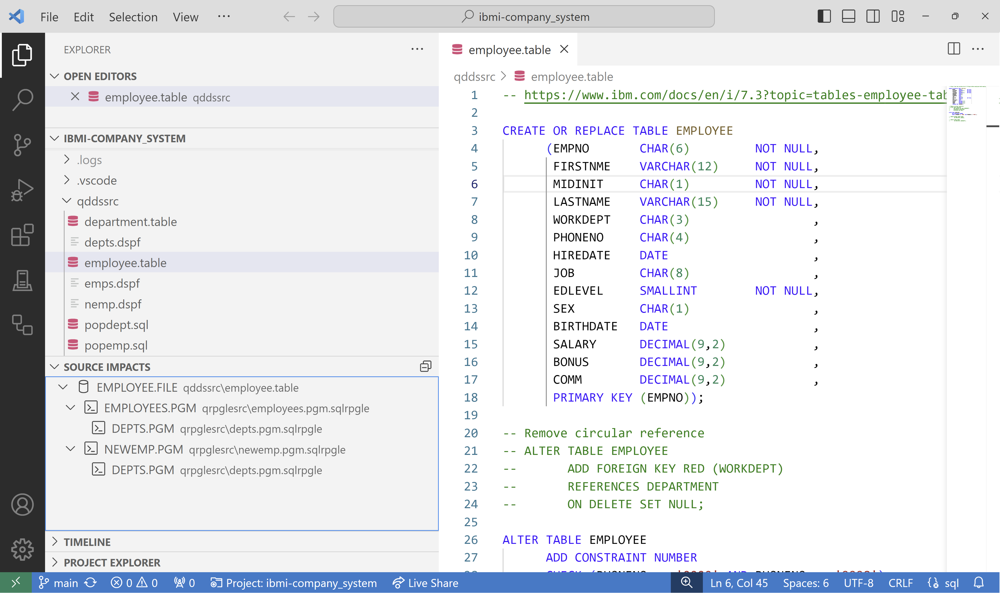
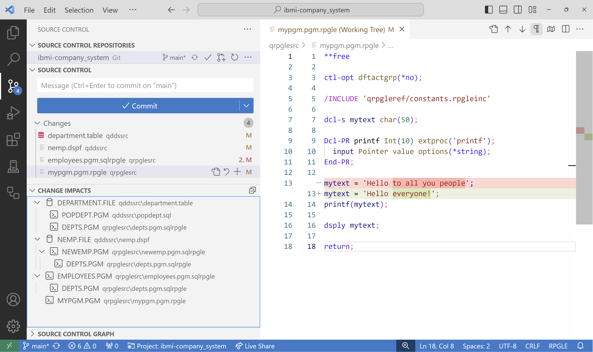
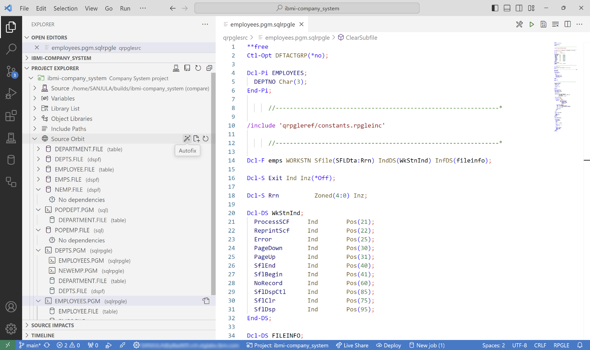

# Overview

[Source Orbit](https://marketplace.visualstudio.com/items?itemName=IBM.vscode-sourceorbit) is available as a Visual Studio Code extension. It offers the ability to use the same CLI features but with a UI that makes it much more convenient to use and visualize!

## View Impacted Objects

The extension comes built with two views for viewing the impacted objects in your project.

The `Source Impacts` view in the `Explorer` view container will render the impacted objects for the current active editor.

<!--  -->

    

The `Change Impacts` view in the `Source Control` view container will render the impacted objects for any files changed detected by Git.

    

## IBM i Project Explorer Integration

Source Orbit integrates seemlessly with the [IBM i Project Explorer](https://marketplace.visualstudio.com/items?itemName=IBM.vscode-ibmi-projectexplorer) extension to allow you to visualize an object dependency tree for your IBM i project. It also provides you easy access to following commonly used Source Orbit features:

* **Auto Fix** (equivalent to [CLI cleanup capabilities](./pages/cli/index?id=cleanup-capabilities))
    * `File Names`: This fixes most extensions for your project. For example, adds the `.pgm` attribute where possible, changes RPGLE headers to use `.rpgleinc` and fixes SQL sources to use right extension based on the `CREATE` statement inside of it.
    * `RPGLE Includes`: This will scan all RPGLE source code in your project and change the include statements to use the unix style path if the mapped source member can be found in the current working directory.
* **Generate Build File** (equivalent to [CLI dependency file generation](./pages/cli/index?id=dependency-file-generation))
    * `json`: Generate all dependency info as JSON (`sourceorbit.json` in the root of the project)
    * `bob`: Generate the required `Rules.mk` files for Bob
    * `make`: Generates a single makefile with the targets and rules
    * `imd`: Generate analysis reports for branches (`impact.md` in the root of the project)

The source migration tool built into IBM i Project Explorer can also automatically perform these tasks after migrating your source from QSYS. Check out more details [here](./pages/general/migrating?id=_1-ibm-i-project-explorer).

    

