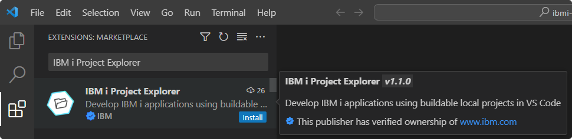

# Installation

## VS Code Marketplace

The Source Orbit extension can be installed from the VS Code Marketplace: [Source Orbit](https://marketplace.visualstudio.com/items?itemName=IBM.vscode-sourceorbit).

<!-- TODO: Add images once published -->

---

## Open VSX Registry

The extension can also be downloaded and manually installed from the Open VSX Registry: [Source Orbit](https://open-vsx.org/extension/IBM/vscode-sourceorbit).

<!-- TODO: Add images once published -->

---

## Suggested Extensions

It is recommended to install the IBM i Project Explorer extension as it integrates with the Source Orbit extension. This can be done from the VS Code Marketplace: [IBM i Project Explorer](https://marketplace.visualstudio.com/items?itemName=IBM.vscode-ibmi-projectexplorer).

