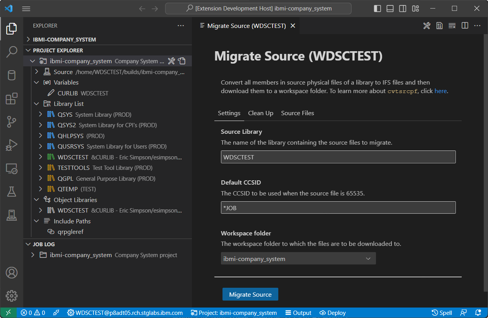

This will cover what migration means, what tools can be used to migrate source members and handling changes to the copy books.

## What migration means

Migration actually means copying the source member contents to the IFS. Only one person has to do this step. Once all the source is migrated into git, is when normal development. If you let someone edit the source members while migrating the source to the IFS, you will have to re-copy the changed members.

For example, your library, source physical files and members might look like this:

```
DEVLIB
  - QRPGLESRC
    - PROGRAMA.RPGLE
    - PROGRAMB.RPGLE
    - PROGRAMC.RPGLE
  - QSQLSRC
    - CUSTOMERS.SQL
    - INVENTORY.SQL
  - QCLLESRC
    - STARTJOB.CLLE
  - QCMDSRC
    - STARTJOB.CMD
```

Where the resulting layout in the repository could be very similar:

```
/home
  /barry
    /.git
    /qrpglesrc
      programa.rpgle
      programb.rpgle
      programc.rpgle
    /qsqlsrc
      customers.sql
      inventory.sql
    /qcllesrc
      startjob.cmd
    /qcmdsrc
      startjob.cmd
```

Make sure that when you migrate the code, you are coding into a directory which is a local repository (e.g. you cloned it) so you can commit & push changes as you make them. For example, make your first commit when you've migrated the code and then make another (or multiple) after you fix up the 'copybooks'.

This means that once you have done the migration, **you no longer developer on the IFS**, but instead, your local workspace.

**Notes about migrating to the IFS**:

1. You will lose the TEXT column that source members have, which is usually used for describing what the source is. Although, you can still put that in the program as a comment. This is subject to change.
2. The type of the source member becomes the extension when in the IFS.
3. Files and directories of sources are usually stored as all lowercase.
4. It is recommended you retain the 10 character limit on programs, commands, modules, etc.
5. Sources on the IFS should be stored as encoding 1208 (UTF-8) or 1252.

## Tools used for migration

Initially migrating the source code can be the hardest part of the entire process, but once it's done: it's done.

### 1. IBM i Project Explorer

The [IBM i Project Explorer](https://marketplace.visualstudio.com/items?itemName=IBM.vscode-ibmi-projectexplorer) is an extension that supports developing IBM i applications using buildable local projects in Visual Studio Code. This extension provides a source migration tool which can be used to migrate source from QSYS libraries into your local project.

Under the hood, this process leverages the `cvtsrcpf` command in `makei` to essentially convert all members in a given source physical file to properly encoded, terminated, and named source files in an IFS directory. Following this conversion, the files are bundled into a tar file which will be downloaded and extracted into your local project so that you can begin with local development. As part of this process, you can also enable the clean up features in Source Orbit to then automatically have the migrated source extensions corrected and include/copy directives fixed to use Unix style paths.

Check out the [migrate source](https://ibm.github.io/vscode-ibmi-projectexplorer/#/pages/projectExplorer/migrate-source) documentation for more details on how to use this tool.



### 2. Using the migrate tool

There is an open source migrate tool, simply named 'migrate', which automates the copying of source members into a directory. It also creates the streamfiles with the correct extensions.

To use the migrate tool, you will need to clone it and build it manually.

```
git clone https://github.com/worksofliam/migrate.git
cd migrate
gmake
```

Building this solution will create the `MIGRATE` library and inside is the `MIGSRCPF` command. `MIGSRCPF` has three simple parameters.


If we had a library with source physical files and wanted to migrate them into a new project directory, we would have to run the command once to migrate the source physical file. It will copy the source member into the IFS as a 1208 (UTF-8) streamfile. If the file or folder it tries to create already exists, it will fail. We created `/home/BARRY/myproject` as a git repository.

```
MIGSRCPF LIBRARY(TESTPROJ) SOURCEPF(QRPGLESRC) OUTDIR('/home/BARRY/myproject')
MIGSRCPF LIBRARY(TESTPROJ) SOURCEPF(QRPGLEREF) OUTDIR('/home/BARRY/myproject')
MIGSRCPF LIBRARY(TESTPROJ) SOURCEPF(QCLLESRC)  OUTDIR('/home/BARRY/myproject')
```

This would create three directories in `/home/BARRY/myproject` like the following:

```
/myproject
  /qrpglesrc
    /somesource.rpgle
    /somesource.rpgle
  /qrpgleref
    /whatever.rpgle
  /qcllesrc
    /pgm1.clle
    /pgm2.clle
    /pgm3.clle
```

Note that it will create all directories and stream files with lowercase names.

### 3. Manually migrating

All a migration consists of is moving source members to the IFS. To our benefit, the `CPYTOSTMF` command exists, which can be used to copy a source member to a stream file. For example:

```
CPYTOSTMF FROMMBR('/QSYS.lib/DEVLIB.lib/QRPGLESRC.file/PROGRAMA.mbr') TOSTMF('/home/barry/myproject/qrpglesrc/programa.rpgle') STMFOPT(*REPLACE) STMFCCSID(1208)
```

On the basis of this command, you would have to run this command for each source member you want to migrate.

### Don't forget to commit changes

Make sure, when you've finished migrating source code into your local developer repository. For example:

```
git add --all
git commit -m "Initial migration step"
git push
```

You will want to do this again (maybe multiple times) as you change the copybooks too.

### Once the source is in git

This is going to sound wild, but: you are no longer going to develop on the IFS! You would instead clone the repository to your local machine and develop there. See [Local Development](https://halcyon-tech.github.io/docs/#/pages/developing/local/getting-started) for more information.

## Clean up the source names

In modern RPGLE projects, the extensions have to be cleaned up to ensure the best developer experience. This is a single step and only has to be done once.

See [Fixing up code](TODO:LINK) as part of the VS Code documentation for Source Orbit.

## Handling 'copybooks' (`/COPY` & `/INCLUDE`)

Source Orbit can automate this step for you. See [Fixing up code](TODO:LINK) as part of the VS Code documentation for Source Orbit.

Once the source has been migrated, another tedious task is changing all the copy books to point to your newly migrated stream files. We're lucky that the C, RPG and COBOL compilers for IBM i all support bringing includes in from the IFS. In this chapter, we will use RPG as it's the primary target audience for this book.

Let's say we have a program that has `/COPY` (or `/INCLUDE`) statements like the following at the top of the source:

```
      /COPY QRPGLEREF,OBJECTS
      /COPY QRPGLEREF,OBJECT
      /COPY QRPGLEREF,FORMATS
      /COPY QRPGLEREF,MEMBERS

      ** --------------------------

     D testproj        PI
     D    pLibrary                   10A   Const

      ** --------------------------
      
```

Even though this source might be in the IFS, `/COPY` (or `/INCLUDE`) can still bring in source from source members in the QSYS file system (and vice versa). What the developer should do is change the statements to use a relative path based on the root of the project to the respective streamfile on the IFS. For example `/COPY QRPGLEREF,OBJECTS` might translate to `/COPY './qrpgleref/objects.rpgleinc'`.

```
      /COPY `qrplgeref/objects.rpgleinc`
      /COPY `qrplgeref/object.rpgleinc`
      /COPY `qrplgeref/formats.rpgleinc`
      /COPY `qrplgeref/members.rpgleinc`
```

The reason you use a path relative to the root of the project is so we can build from the root of the project within our command line, IDE or our build system (which you will see later). It's not required that you do this to all your source at once, because you can still depend on the existing source members during a migration period - although **it is recommended you change them as soon as possible**. While it's not recommend, you can do it iteratively and change them when you work on the source. This is dangerous because the source members aren't under change control.

If you are using a 3rd party tool, like the HTTPAPI, which as it's headers in source members, then you can leave those `/COPY` (or `/INCLUDE`) statements along side your includes which point to the IFS:

```
      /COPY `qrplgeref/objects.rpgleinc`
      /COPY `qrplgeref/object.rpgleinc`
      /COPY `qrplgeref/formats.rpgleinc`
      /COPY `qrplgeref/members.rpgleinc`
      /COPY QRPGLEREF,HTTPAPI_H
```